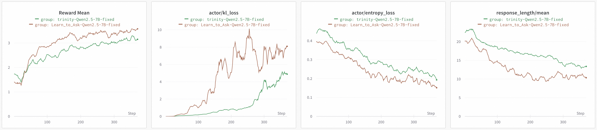

# Learn2Ask: Getting Started Guide

This guide demonstrates how to train a proactive LLM using the **Learn2Ask** framework from [Grounded in Reality: Learning and Deploying Proactive LLM from Offline Logs](https://arxiv.org/abs/2510.25441).

---

## 🖥️ Hardware Requirements

- **Full-scale training**: At least **8 H20 GPUs** (or equivalent).
- **Lightweight option**: You can use the **[Tinker backend](https://thinkingmachines.ai/tinker/)** without any GPUs.

> 💡 All code and configuration files are located in:
> `examples/training/learn_to_ask/`

Key files:
- Workflow & Training: `examples/training/learn_to_ask/main.py`
- Prompts: `examples/training/learn_to_ask/prompt.py`
- Training config: `examples/training/learn_to_ask/config.yaml`
- Data preparation scripts: `examples/training/learn_to_ask/data_prepare/`

---

## Step 1: Prepare Your Dataset

### 1.1 Download the Dataset
Download the **[RealMedConv](https://huggingface.co/datasets/datajuicer/RealMedConv)** dataset (in `.jsonl` format). Each line represents a complete doctor-patient conversation log, like this:

```json
{
  "session_id": 35310,
  "diagn": "Upper Respiratory Tract Infection",
  "messages": [
    {"role": "user", "content": "Sore throat, phlegm, red eyes, cough, hoarse voice"},
    {"role": "user", "content": "I took Amoxicillin"},
    ...
    {"role": "assistant", "content": "<med_search>"}
  ]
}
```

### 1.2 Preprocess the Data
You need to convert raw conversation logs into training samples. This involves two steps:

#### 🔹 Step A: Segment Conversations & Extract Labels
Split each conversation into **context–future pairs**, and extract ground-truth symptom information (`info_truth`) from what happens next.

```bash
python examples/training/learn_to_ask/data_prepare/1_info_extract_pipeline.py \
  --input_file /path/to/RealMedConv/train.jsonl \
  --output_file examples/training/learn_to_ask/data_raw/train_processed.jsonl
```

#### 🔹 Step B: Build Final Training Dataset
Convert the processed samples into the final format used for training/testing.

```bash
python examples/training/learn_to_ask/data_prepare/2_build_dataset.py \
  --input_file examples/training/learn_to_ask/data_raw/train_processed.jsonl \
  --output_file examples/training/learn_to_ask/data/train.jsonl
```

---

### How It Works: Context–Future Segmentation

For every turn in a conversation, we create a sample with:
- `messages`: The **observed dialogue history** up to that point (the *context*).
- `remaining_chat`: Everything that happens **after** that point (the *future*).
- A unique ID: `cid = {session_id}_{turn_index}`

Example output:
```json
{
  "cid": "35310_7",
  "session_id": "35310",
  "diagn": "Upper Respiratory Tract Infection",
  "messages": [ ... up to turn 7 ... ],
  "remaining_chat": [ ... all future messages ... ]
}
```

### Extract Ground-Truth Labels

From `remaining_chat`, we automatically derive two key labels:
- `decision_truth`: Should the assistant **continue asking questions** (`"continue"`) or **stop** (`"stop"`)?
- `info_truth`: Structured list of symptoms mentioned later (used to compute reward signals during training).

Example:
```json
{
  "decision_truth": "continue",
  "info_truth": "Symptom: sore throat, Symptom quality: thick discharge, Symptom quality: yellowish discharge, ..."
}
```

These labels power the reward functions $R_a$ (action accuracy) and $R_s$ (symptom coverage) during training.

---

## Step 2: Configure and Train the Model

### Option A: Edit Python Script (Simple)
Open `examples/training/learn_to_ask/main.py` and adjust settings:

```python
if __name__ == "__main__":
    train_mode = "Ra+Rs"     # Use both action and symptom rewards
    fusion_mode = "default"  # How to combine rewards
    dataset = Dataset(path="examples/training/learn_to_ask/data", split="train")

    tuner_model = TunerChatModel(
        model_path="Qwen/Qwen2.5-7B-Instruct",
        max_model_len=8192,
        tensor_parallel_size=1,  # Adjust based on your GPU setup
        ...
    )

    auxiliary_models = {
        "grader": TunerChatModel(
            model_path="Qwen/Qwen2.5-32B-Instruct",  # Larger model for evaluation
            tensor_parallel_size=2,
            ...
        )
    }

    algorithm = Algorithm(
        algorithm_type="grpo",
        learning_rate=5e-7,
        batch_size=64,
    )

    tune(...)  # Starts training
```

### Option B: Use YAML Config (Advanced)
Edit `examples/training/learn_to_ask/train.yaml` for more control.

#### 🌐 No GPU? Use Tinker!
If you don’t have GPUs, enable the **Tinker backend** by setting:

```yaml
model:
  model_path: Qwen/Qwen2.5-7B-Instruct
  tinker:
    enable: true  # ← Set this to true
```

> 🔗 Learn more about Tinker: [Tinker Backend Documentation](https://modelscope.github.io/Trinity-RFT/en/main/tutorial/example_tinker_backend.html)

### Launch Training
```bash
python examples/training/learn_to_ask/main.py
```

---

## Step 3: Evaluate Your Trained Model

Use the **rollout-and-evaluate pipeline**:
1. Generate responses on the test set.
2. Score them using a powerful evaluator model (`Qwen2.5-32B-Instruct`).

Run evaluation:
```bash
python examples/training/learn_to_ask/data_prepare/3_rollout_then_evaluate.py \
  --eval_model_path path/to/your/trained/model \
  --grader_model_path Qwen/Qwen2.5-32B-Instruct \
  --test_file_path examples/training/learn_to_ask/data/test.jsonl \
  --rollout_file_path path/to/rollout.jsonl \
  --eval_file_path path/to/output.jsonl
```

> ⚠️ **Note**: Your trained model must be converted to **Hugging Face format** first.
> See: [Converting FSDP Checkpoints Guide](https://modelscope.github.io/Trinity-RFT/en/main/tutorial/faq.html)

---

## 📊 Results

We compared three approaches:
- **Base model**: `Qwen2.5-7B-Instruct` (no fine-tuning)
- **Trinity**: Direct response generation
- **As-tune (Learn2Ask)**: Uses a ReAct agent for proactive questioning

| Metric                                | Base Model | Trinity | As-tune (Learn2Ask) |
|--------------------------------------|-----------:|--------:|--------------------:|
| Avg. continue content                |      0.436 |   0.496 |               0.509 |
| Win rate (continue content)          |      0.122 |   0.246 |               0.224 |
| Avg. continue decision accuracy      |      0.963 |   0.909 |               0.922 |
| Avg. stop decision accuracy          |      0.024 |   0.927 |               0.909 |
| **Total decision accuracy**          |      0.467 |   0.918 |               0.915 |
| **Response format quality**          |      0.376 |   0.713 |               0.882 |
| **Total reward**                     |      1.281 |   3.078 |               3.237 |



> ✅ **Key insight**: Learn2Ask (As-tune) achieves the highest overall performance by teaching the model **when and what to ask**—making it truly proactive.

---

## 📚 Citation

If you use this code or framework, please cite our work:

```bibtex
@misc{learn2ask,
      title={Grounded in Reality: Learning and Deploying Proactive LLM from Offline Logs},
      author={Fei Wei and Daoyuan Chen and Ce Wang and Yilun Huang and Yushuo Chen and Xuchen Pan and Yaliang Li and Bolin Ding},
      year={2025},
      eprint={2510.25441},
      archievePrefix={arXiv},
      primaryClass={cs.AI},
      url={https://arxiv.org/abs/2510.25441}
}
```
